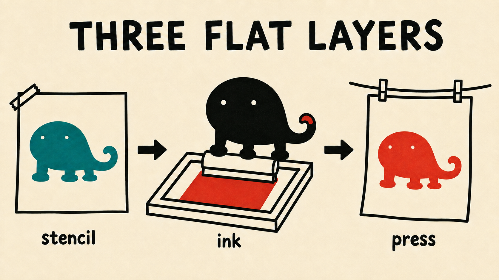

# lukis-skill

**Original print-style editorial illustrations for agents — a recurring
mascot performs the idea.**

`/lukis we replatform with zero downtime` → the deadpan house gecko Ciko,
screenprinted mid-rebuild on a bridge under live traffic. `/lukis surprise
me` → one fresh poster, picked from three candidates. `/lukis as labeled
stages` → the same mascot drawing your pipeline as a hand-built explainer.

*"many inputs become one decision" — Ciko at the gate, in sablon on the
pasar palette:*

*"three flat layers" — the explainer register, stencil to ink to press, in sablon on the pasar palette:*

- **Out of the box:** Ciko, a deadpan cicak (house gecko), in **sablon** —
  hand-pulled screenprint, flat spot-color inks, thick stencil line.
- **Eighteen bundled looks** — sablon, riso, woodcut, pixel, clay, chalk,
  gouache, felt, diorama, bricks, and more; one look per character pack.
- **Your own mascot** — the built-in character builder interviews you and
  installs a named pack; community packs install from a shared catalog.
- **Three engine backends** — free generation through your Codex or Grok
  CLI subscription when available, OpenRouter otherwise (pay-per-image,
  typically under ten cents).
- **Methodology, not vibes** — reference-locked character consistency, one
  idea per image, accent discipline, a quality bar enforced before you see
  the result.

## Install

| Platform | Install |
| --- | --- |
| **Claude Code** | `/plugin marketplace add madearga/lukis-skill` then `/plugin install lukis@lukis-skill` |
| **Codex** | `codex plugin marketplace add madearga/lukis-skill` then `codex plugin add lukis@lukis-skill` |
| **Grok CLI** | `grok plugin marketplace add madearga/lukis-skill` then `grok plugin install madearga/lukis-skill --trust` |
| **Gemini CLI** | `gemini extensions install https://github.com/madearga/lukis-skill` |
| **Cursor / other agents** | `npx skills add madearga/lukis-skill --skill lukis` |

Then check readiness: `python3 "$SKILL_DIR/scripts/lukis.py" doctor`.
Full docs, engines, models, and cost: **[skills/lukis/README.md](skills/lukis/README.md)**.

## Credits

Lukis descends from [tmchow/illo-skill](https://github.com/tmchow/illo-skill)
(MIT © Trevin Chow): it began as an identity fork, and the engine has since
been rewritten in this repository. The architecture, methodology, and parts
of the bundled look library still derive from illo. The lukis identity (name,
the **Ciko** mascot, the **sablon** default look, the **pasar** palette) is
original work © I Made Arga Swarsa. Both copyrights live in
[LICENSE](LICENSE) and [skills/lukis/NOTICE](skills/lukis/NOTICE) — keep them
if you redistribute.

MIT licensed.
